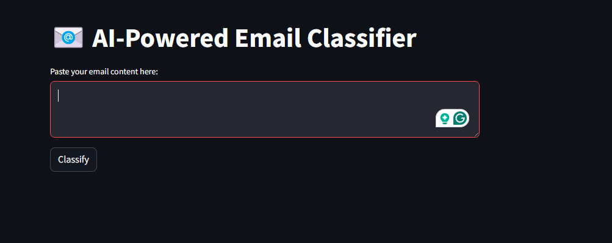
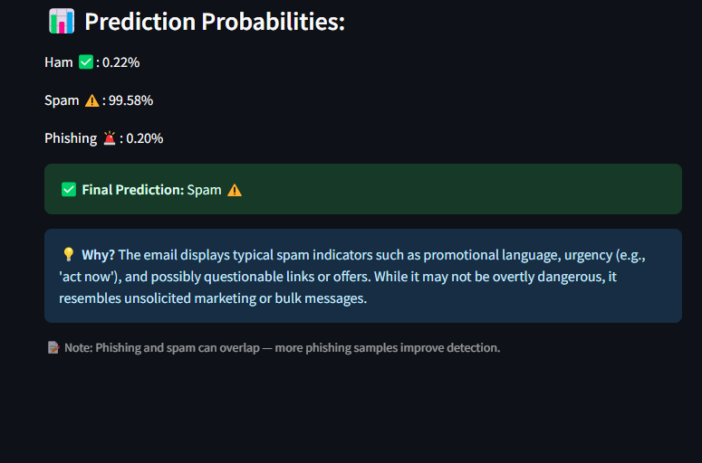

# 📧 AI-Powered Email Spam and Phishing Detection

This is a robust, Deep Learning based system for detecting **spam** and **phishing** emails using Natural Language Processing (NLP) and deep learning. It outperforms traditional rule-based filters by learning patterns from real data, with a CNN-based classifier that achieves **97% accuracy**.

> **Tech Stack:** Python · Scikit-learn · TensorFlow/Keras · SHAP · Streamlit · Google Colab  
> **AI Techniques:** TF-IDF · CNN · SVM · Random Forest · SHAP Explainability  
> **UI:** Interactive Streamlit Web App  
> **Role:** Sole developer and integrator

---

## 📸 Demo

### Paste or Upload an Email

### View Model Prediction (Phishing or Legitimate)

---

## 🧠 Overview

Traditional email filters often fail against evolving phishing strategies. DL-PhishGuard uses a deep learning approach with interpretable predictions to reliably detect malicious emails in real-time.

### Core Features
- ⚙️ **End-to-end NLP pipeline**: tokenization, stemming, TF-IDF
- 🧠 **Multiple models**: CNN (best), SVM, Random Forest
- 🧾 **Explainability**: SHAP highlights the most suspicious words
- 💻 **Streamlit UI**: paste email text or upload `.txt` file

---

## 🔍 Methodology

### 1. Data Acquisition & Preprocessing
- Sources: SpamAssassin, Enron, Phishing Websites dataset
- Steps: Tokenization · Stopword removal · Lemmatization · Header cleanup

### 2. Feature Engineering
- Vectorized text using **TF-IDF**
- Future support for: hyperlink count, sender domain mismatch, keyword flags

### 3. Model Training
- 🧪 Models: CNN, SVM, Random Forest
- 🏆 **Best Model**: CNN with **97% Accuracy**, **97% F1-Score**
- Training: Stratified 5-fold CV · GridSearchCV · sklearn pipelines

### 4. UI & Explainability
- **Streamlit UI**: Paste email or upload file for prediction
- **SHAP**: Visual highlights of influential terms like "verify", "click here"

---

## 📊 Results

| Model          | Accuracy | Precision | Recall | F1-Score |
|----------------|----------|-----------|--------|----------|
| 🧠 CNN (Best)  | 97%      | 97%       | 97%    | 97%      |
| 🔍 SVM         | 95.1%    | 95.1%     | 94.6%  | 94.8%    |
| 🌲 RandomForest| 94.9%    | 91.5%     | 92.4%  | 91.9%    |

**Observation**: CNN performed best, especially on short, urgent phishing content.

---

## 🚀 Future Enhancements

- ⚡ Integrate **transformers** (e.g., BERT, DistilBERT) for contextual understanding
- 🌐 Add **real-time email scanning** via Gmail/Outlook API
- 🌍 Support for **multilingual datasets**
- 📊 Display **email metadata** (suspicious sender domains, time stamps, headers)

---

## 📌 Key Highlights

✅ Real-world threat detection  
✅ High model accuracy with interpretability  
✅ Streamlit UI for intuitive testing  

---

## 📬 Contact

For feedback or collaboration:  
📧 [vishvendrareddy.site](https://vishvendrareddy.site)

